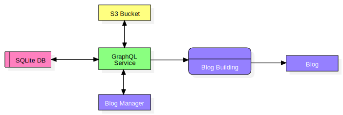

# blog

For some time I've been wanting to write a blog. Sometime ago I had a Medium account and wrote a
few posts, however I don't like so much the idea of using somebody else's platform for that. And
don't get me wrong, online solutions such as Medium and Dev are probably a better idea to write a
blog, they have everything ready to go and their reliability is great. Using an online solution I
don't need to worry about anything else but write an article, but I want to build a new tool, just
for fun. Also I don't like the idea of having a paywall to write or read posts, and having more ads
in the Internet feels awful.

Back in the day everybody had their own blog, maybe is a good idea to go back to those early times
of the Internet. But most importantly, I want to write this software, even if its more work for me
in the long run, I want to write a Rust server and to figure out the architecture for the blog, as
it needs to have a client facing UI as well as an admin UI for managing the posts.

## Architecture

This is probably not the best way to build a blogging platform, but will be perfect for my use-case,
and it may be useful to somebody else, but keep in mind that the architecture is somewhat
convoluted.

The platform has three parts: The blog service which is a GraphQL API with a database, the blog
manager which is the UI to write and manage the posts and finally the blog itself, which is a
statically built website using Next.js.



Following the diagram, the most important part of it all is the blog itself, which gets statically
built with Next.js and deployed like that. This gives many advantages like easy caching through a
CDN, easy to crawl by search engines, easy to cache by browsers, etc.

However it also has a high complexity and moving parts to make it work. It requires a service to
store all the data which will be used to build the blog, and it also means that if a new post gets
added, or an existing one gets edited or archived/removed, the "building" process has to happen
again. Which should be ok, it's an action that will not happen frequently.

The blog manager & service needs to be deployed to the Internet, so the script that builds the blog
has access to the data. The building process will get executed by a platform like Github or Vercel
when the Next.js gets built & deployed.

## Alternative design

As mentioned, the most important part is the final blog that gets build. How that happens is
irrelevant. Instead of having a GraphQL service & manager that lives in the Internet, another
approach could be to build a CLI or a Desktop application that reads local Markdown files and then
publish a DB that includes the data so it can be used by the building tool could also work.

The benefits to this design are:

- less infrastructure needed
- No need to have an online editor, just a regular editor for markdown

But it will make the building script probably more complex, as it'll need to query data directly
from the DB.

## Development

### Requirements

- Rust >= 1.61.1

### How to Run

Start by copying the `.env.example` and make a new `.env` file based on that. Then the DB generation
is possible. But maybe it's necessary to make a new empty file such as `blog.db` to be able to run
the migrations, which happen automatically when the server starts running.

```bash
cargo watch -x run -i schema.gql
```

Alternatively, the migrations are able to run without the server by running the following command

```bash
# To apply migrations
cargo run --package migration -- up

# To rollback a migration
cargo run --package migration -- down

# To rollball all migrations and run them again
cargo run --package migration -- refresh
```

### New migrations

Whenever a new migration is added according to the
[documentation](https://www.sea-ql.org/SeaORM/docs/migration/setting-up-migration), the entities
must be updated. This project uses code generation to build the entities used in the code by
running the following code.

```bash
sea-orm-cli generate entity -o ./entity/src --with-serde
```

However, the [sea-orm-cli](https://www.sea-ql.org/SeaORM/docs/generate-entity/sea-orm-cli/) is not
perfect, there are some discrepancies that need to be fixed by hand, hence the need for the
[defaults.rs](./entity/src/defaults.rs) file.
